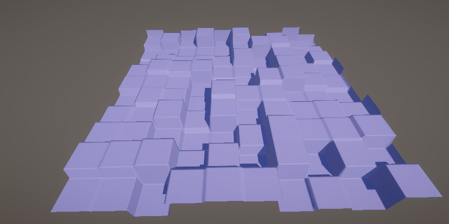
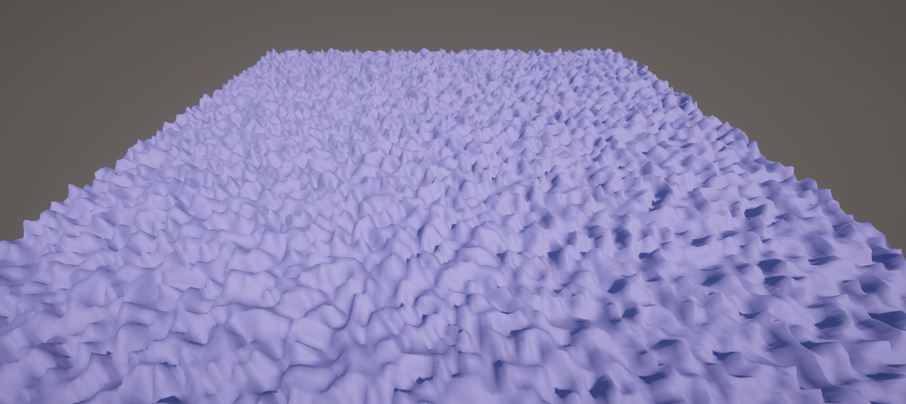
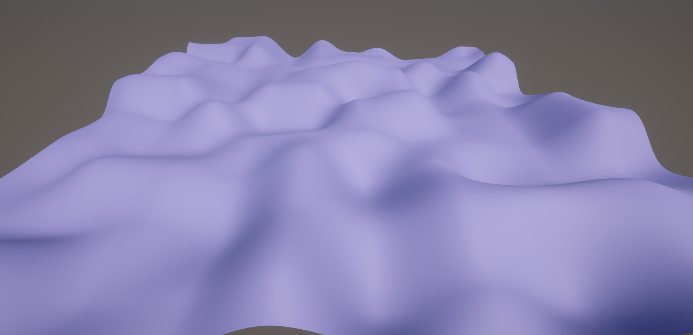

### IF we divide the integer portion and use it as input for the noise generator, we can create blocky landscapes

c7c88a063c4cfd9972acff29ed579f4e399ddfe2

### If we interpolate along the four points on the cell, we get a smoother noise

8587e74c5846515395d81d43eb8c47fa0b798e3d

### Decreasing the frequency of the noise and increasing amplitude -> dividing the grid space and increasing height multiplier

c7dc0cfbea7ff76872b8c58b35b15132278b61e1

## Value Noise vs Gradient Noise

- Use value noise as the gradient for the actual noise in the scene.
- Value noise - used for height or normal maps, the noise value is more hectic.
- Gradient Noise - used for terrain generation
